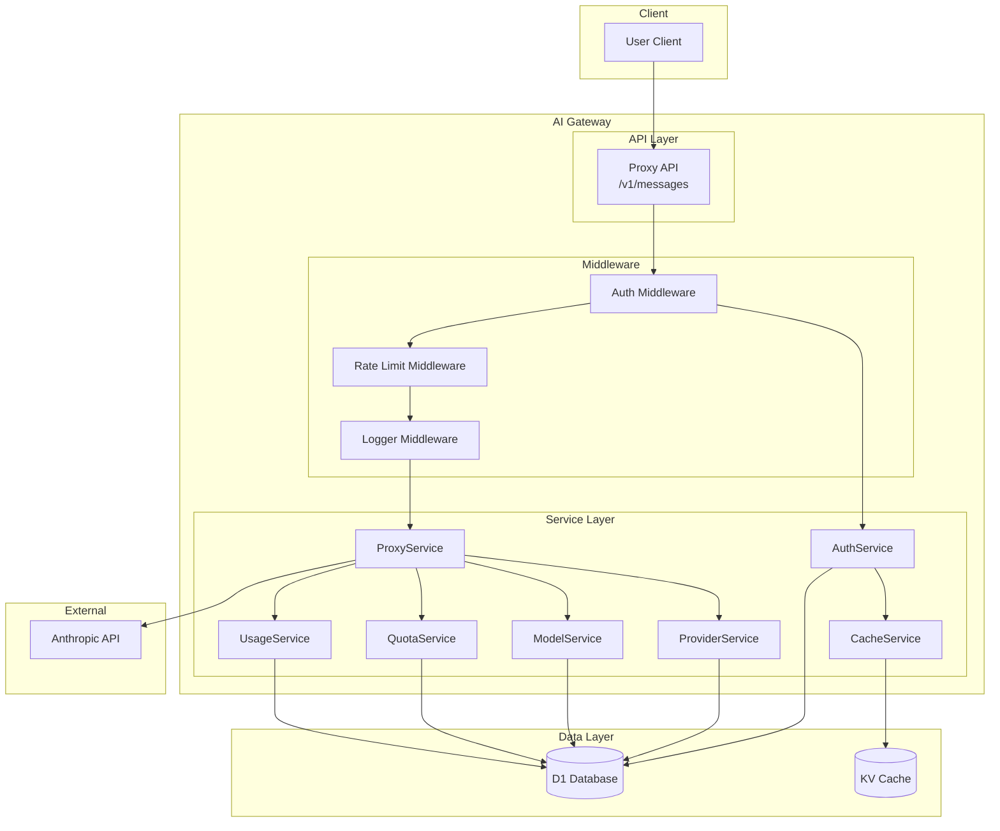
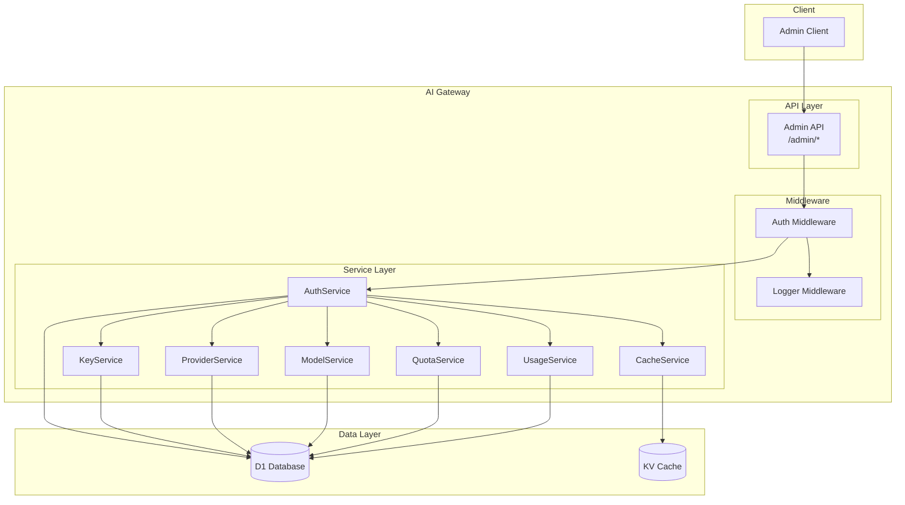
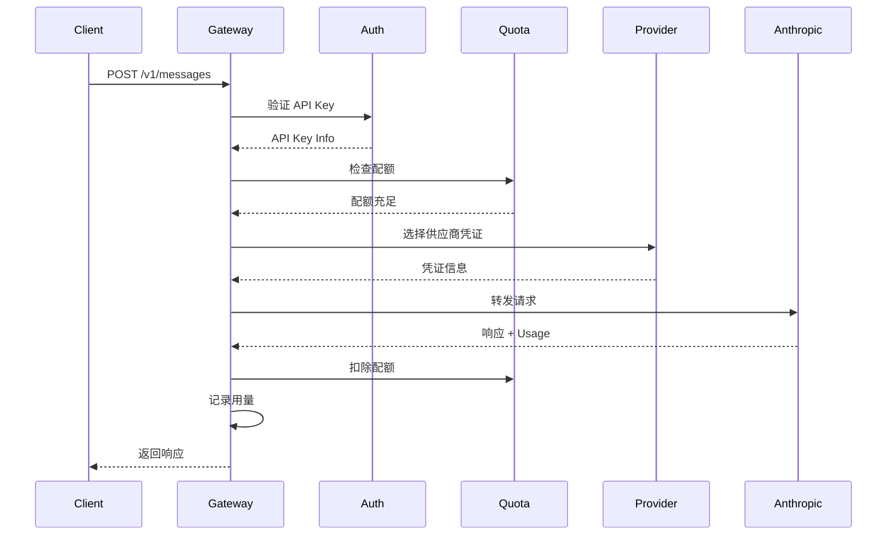
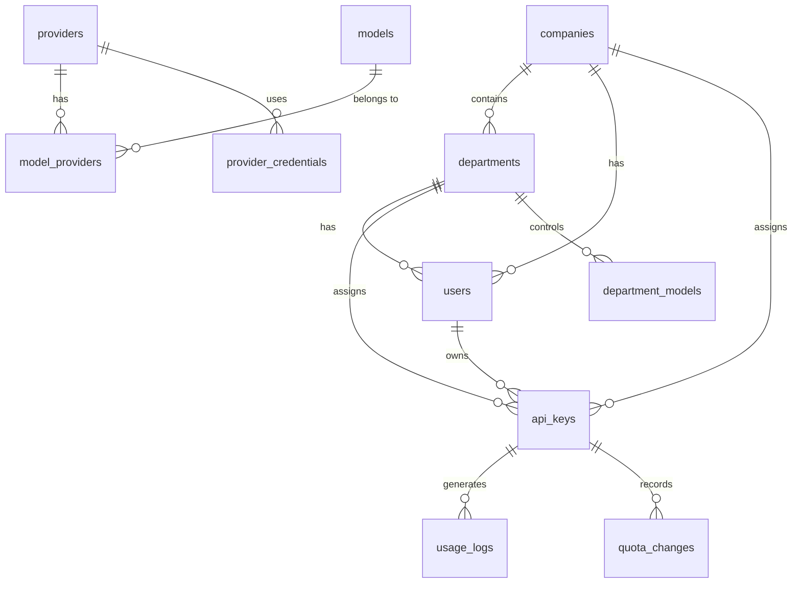
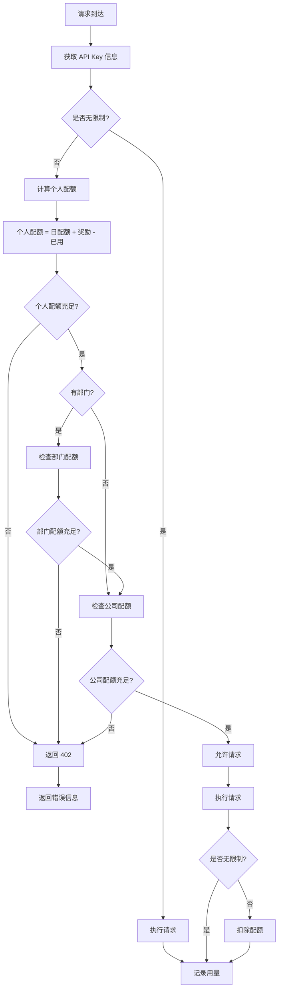
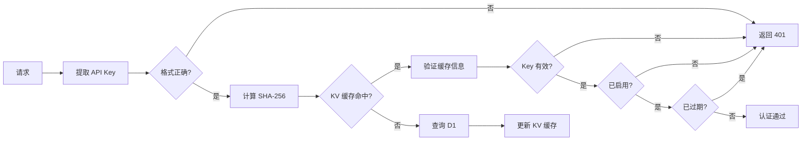
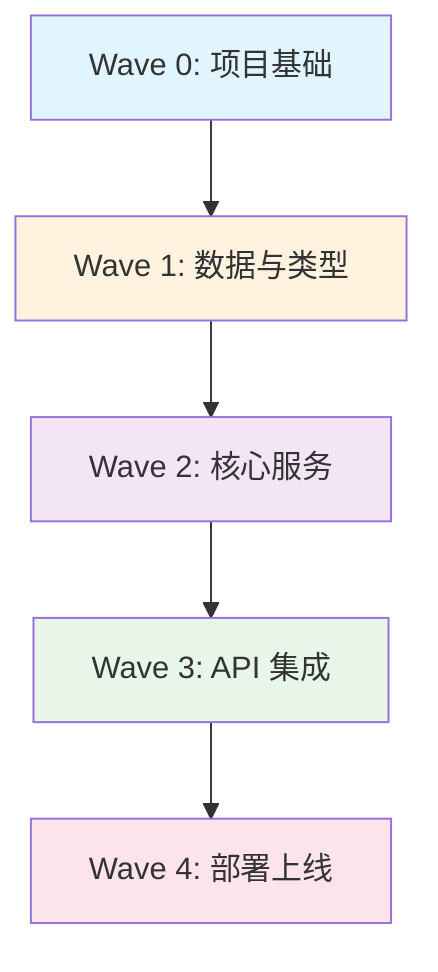

# AI Gateway PRD (Product Requirements Document)

## 1. 项目概述

### 1.1 目标
构建一个基于 Cloudflare Workers 的 AI Gateway，用于代理转发 Anthropic API 请求，提供供应商管理、模型管理、API Key 管理和 Token 限制/统计功能。

### 1.2 组织架构
```
公司 (Company)
  └── 部门 (Department)
        └── 个人 (User) → API Key
```

### 1.3 技术栈
- **Runtime**: Cloudflare Workers
- **Language**: TypeScript
- **Database**: Cloudflare D1 (SQLite)
- **Cache**: Cloudflare KV
- **Config**: wrangler.jsonc

---

## 2. 系统架构

### 2.1 用户请求架构图



**服务说明**：
- **AuthService**: API Key 验证，返回用户上下文（Auth Middleware 调用）
- **ProviderService**: 供应商凭证管理、负载均衡选择可用凭证
- **ModelService**: 模型配置管理、**验证用户是否有权使用该模型**
- **QuotaService**: 配额检查与扣除
- **UsageService**: 记录 Token 用量

### 2.2 管理请求架构图



**API 路由映射**：
| 管理端点 | 调用服务 |
|---------|---------|
| `/admin/keys/*` | KeyService |
| `/admin/providers/*` | ProviderService |
| `/admin/models/*` | ModelService |
| `/admin/quotas/*` | QuotaService |
| `/admin/stats/*` | UsageService |

### 2.2 请求处理流程



---

## 3. 数据库设计

### 3.1 表结构总览



### 3.2 表定义

#### 3.2.1 组织架构表

```sql
-- 公司表
CREATE TABLE companies (
    id TEXT PRIMARY KEY,
    name TEXT UNIQUE NOT NULL,
    quota_pool INTEGER DEFAULT 0,
    quota_used INTEGER DEFAULT 0,
    quota_daily INTEGER DEFAULT 0,
    daily_used INTEGER DEFAULT 0,
    last_reset_at INTEGER,
    created_at INTEGER NOT NULL,
    updated_at INTEGER NOT NULL
);
```
**说明**：
- `quota_pool`: 公司级配额池（总量，用完为止，需手动充值）
- `quota_used`: 配额池已用量
- `quota_daily`: 公司级日配额（每日自动重置）
- `daily_used`: 日配额已用量
- `last_reset_at`: 上次日配额重置时间（UTC 0:00）

```sql
-- 部门表
CREATE TABLE departments (
    id TEXT PRIMARY KEY,
    company_id TEXT NOT NULL,
    name TEXT NOT NULL,
    quota_pool INTEGER DEFAULT 0,
    quota_used INTEGER DEFAULT 0,
    quota_daily INTEGER DEFAULT 0,
    daily_used INTEGER DEFAULT 0,
    last_reset_at INTEGER,
    created_at INTEGER NOT NULL,
    updated_at INTEGER NOT NULL,
    FOREIGN KEY (company_id) REFERENCES companies(id)
);
```
**说明**：
- `company_id`: 所属公司
- `quota_pool`: 部门级配额池（总量，用完为止）
- `quota_used`: 配额池已用量
- `quota_daily`: 部门级日配额（每日自动重置）
- `daily_used`: 日配额已用量
- `last_reset_at`: 上次日配额重置时间（UTC 0:00）

```sql
-- 用户表
CREATE TABLE users (
    id TEXT PRIMARY KEY,
    email TEXT UNIQUE NOT NULL,
    name TEXT,
    company_id TEXT NOT NULL,
    department_id TEXT,
    role TEXT DEFAULT 'user',
    quota_daily INTEGER DEFAULT 0,
    quota_used INTEGER DEFAULT 0,
    is_active BOOLEAN DEFAULT TRUE,
    last_reset_at INTEGER,
    created_at INTEGER NOT NULL,
    updated_at INTEGER NOT NULL,
    FOREIGN KEY (company_id) REFERENCES companies(id),
    FOREIGN KEY (department_id) REFERENCES departments(id)
);
```
**说明**：
- `role`: 用户角色（`admin` / `user`）
- `department_id`: 可选，用户可不归属部门
- `quota_daily`: 用户级日配额（每日自动重置）
- `quota_used`: 日配额已用量（汇总该用户所有 API Key）
- `last_reset_at`: 上次配额重置时间（UTC 0:00）

**配额机制说明**：

系统支持两种配额模式：

| 模式 | 字段 | 刷新机制 | 适用场景 |
|------|------|---------|---------|
| **配额池** | `quota_pool` / `quota_used` | 手动充值，用完为止 | 公司/部门总量控制 |
| **日配额** | `quota_daily` / `daily_used` | 每日 UTC 0:00 自动重置 | 日常使用限制 |

**配额刷新机制**：
1. **自动重置**：每日 UTC 0:00 通过定时任务重置 `*_used` 字段
2. **重置判断**：比较 `last_reset_at` 与当前日期（UTC 0:00）
3. **重置范围**：按需重置（懒加载），请求时检查并重置过期配额

**配额检查顺序**（从细到粗）：

```
请求 → API Key 日配额 → 用户日配额 → 部门日配额 → 部门配额池 → 公司日配额 → 公司配额池
```

#### 3.2.2 供应商和模型表

```sql
-- 供应商表
CREATE TABLE providers (
    id TEXT PRIMARY KEY,
    name TEXT UNIQUE NOT NULL,
    display_name TEXT NOT NULL,
    base_url TEXT NOT NULL,
    api_version TEXT,
    is_active BOOLEAN DEFAULT TRUE,
    created_at INTEGER NOT NULL,
    updated_at INTEGER NOT NULL
);
```
**说明**：
- `name`: 供应商唯一标识（如 `anthropic`、`openai`）
- `base_url`: API 端点，支持动态配置
- `api_version`: API 版本（如 `2023-06-01`）

```sql
-- 模型表（移除 provider_id，模型可属于多个供应商）
CREATE TABLE models (
    id TEXT PRIMARY KEY,
    model_id TEXT NOT NULL UNIQUE,
    display_name TEXT NOT NULL,
    context_window INTEGER DEFAULT 0,
    max_tokens INTEGER DEFAULT 0,
    is_active BOOLEAN DEFAULT TRUE,
    created_at INTEGER NOT NULL,
    updated_at INTEGER NOT NULL
);
```
**说明**：
- `model_id`: 模型唯一标识（如 `claude-3-sonnet`）
- `context_window`: 上下文窗口大小
- `max_tokens`: 最大输出 token 数

```sql
-- 模型-供应商关联表（多对多）
CREATE TABLE model_providers (
    id TEXT PRIMARY KEY,
    model_id TEXT NOT NULL,
    provider_id TEXT NOT NULL,
    input_price REAL DEFAULT 0,
    output_price REAL DEFAULT 0,
    priority INTEGER DEFAULT 0,
    is_active BOOLEAN DEFAULT TRUE,
    created_at INTEGER NOT NULL,
    FOREIGN KEY (model_id) REFERENCES models(id),
    FOREIGN KEY (provider_id) REFERENCES providers(id),
    UNIQUE(model_id, provider_id)
);
```
**说明**：
- 一个模型可属于多个供应商
- `input_price` / `output_price`: 每 1K token 价格（USD）
- `priority`: 供应商优先级，数值越大优先级越高

```sql
-- 部门模型配置表（部门可访问的模型）
CREATE TABLE department_models (
    id TEXT PRIMARY KEY,
    department_id TEXT NOT NULL,
    model_id TEXT NOT NULL,
    is_allowed BOOLEAN DEFAULT TRUE,
    daily_quota INTEGER DEFAULT 0,
    created_at INTEGER NOT NULL,
    FOREIGN KEY (department_id) REFERENCES departments(id),
    FOREIGN KEY (model_id) REFERENCES models(id),
    UNIQUE(department_id, model_id)
);
```
**说明**：
- `is_allowed`: 部门是否可使用该模型
- `daily_quota`: 该模型在部门内的日配额限制

**供应商配置说明**：
- `base_url`: 支持动态配置，可指向不同的 API 端点
  - 官方端点：`https://api.anthropic.com`
  - 代理端点：企业内部代理或其他兼容端点
  - 测试环境：不同环境的测试端点
- 同一供应商可配置多个凭证，每个凭证独立管理健康状态
- 支持通过 Admin API 动态修改 `base_url`，无需重新部署

**跨供应商负载均衡**：
- 一个模型可属于多个供应商（通过 `model_providers` 关联表）
- 负载均衡策略：基于 `api_key_id` 进行一致性哈希
  1. 先选择供应商：在模型所属的所有供应商中进行哈希
  2. 再选择凭证：在选中供应商的所有可用凭证中进行哈希
- 同一用户的同一模型请求，始终使用同一个供应商的同一个凭证
- 凭证健康检查失败时，自动切换到下一个可用凭证

#### 3.2.3 API Key 和凭证表

```sql
-- API Keys 表
CREATE TABLE api_keys (
    id TEXT PRIMARY KEY,
    key_hash TEXT UNIQUE NOT NULL,
    key_prefix TEXT NOT NULL,
    user_id TEXT NOT NULL,
    company_id TEXT NOT NULL,
    department_id TEXT,
    name TEXT,
    quota_daily INTEGER DEFAULT 0,
    quota_used INTEGER DEFAULT 0,
    quota_bonus INTEGER DEFAULT 0,
    quota_bonus_expiry INTEGER,
    is_unlimited BOOLEAN DEFAULT FALSE,
    is_active BOOLEAN DEFAULT TRUE,
    last_reset_at INTEGER,
    last_used_at INTEGER,
    expires_at INTEGER,
    created_at INTEGER NOT NULL,
    updated_at INTEGER NOT NULL,
    FOREIGN KEY (user_id) REFERENCES users(id),
    FOREIGN KEY (company_id) REFERENCES companies(id)
);
```
**说明**：
- `key_hash`: API Key 的 SHA-256 哈希值（存储用）
- `key_prefix`: API Key 前缀（如 `sk-xxx...`，用于展示）
- `quota_daily`: 日配额限制
- `quota_bonus`: 奖励配额
- `quota_bonus_expiry`: 奖励配额过期时间
- `is_unlimited`: 是否无限制账户
- `last_reset_at`: 上次配额重置时间（UTC 0:00）
- `last_used_at`: 上次使用时间

```sql
-- 供应商凭证表
CREATE TABLE provider_credentials (
    id TEXT PRIMARY KEY,
    provider_id TEXT NOT NULL,
    credential_name TEXT NOT NULL,
    api_key_encrypted TEXT NOT NULL,
    is_active BOOLEAN DEFAULT TRUE,
    priority INTEGER DEFAULT 0,
    weight INTEGER DEFAULT 1,
    health_status TEXT DEFAULT 'unknown',
    last_health_check INTEGER,
    created_at INTEGER NOT NULL,
    updated_at INTEGER NOT NULL,
    FOREIGN KEY (provider_id) REFERENCES providers(id)
);
```
**说明**：
- `api_key_encrypted`: 加密存储的供应商 API Key
- `priority`: 凭证优先级，数值越大优先级越高
- `weight`: 负载均衡权重
- `health_status`: 健康状态（`healthy` / `unhealthy` / `unknown`）

#### 3.2.4 用量和配额表

```sql
-- 用量记录表
CREATE TABLE usage_logs (
    id TEXT PRIMARY KEY,
    api_key_id TEXT NOT NULL,
    user_id TEXT NOT NULL,
    company_id TEXT NOT NULL,
    department_id TEXT,
    provider_id TEXT NOT NULL,
    model_id TEXT NOT NULL,
    model_name TEXT NOT NULL,
    endpoint TEXT NOT NULL,
    input_tokens INTEGER DEFAULT 0,
    output_tokens INTEGER DEFAULT 0,
    total_tokens INTEGER DEFAULT 0,
    status TEXT NOT NULL,
    error_code TEXT,
    request_id TEXT,
    response_time_ms INTEGER,
    created_at INTEGER NOT NULL,
    FOREIGN KEY (api_key_id) REFERENCES api_keys(id)
);
```
**说明**：
- `input_tokens`: 输入 Token 数量（prompt）
- `output_tokens`: 输出 Token 数量（completion）
- `total_tokens`: 总计 = input_tokens + output_tokens
- `status`: 请求状态（`success` / `error`）
- 所有请求均记录，包括成功和失败（失败时 token 为 0）
- 配额扣除基于 `total_tokens`

```sql
-- 配额变更记录表
CREATE TABLE quota_changes (
    id TEXT PRIMARY KEY,
    entity_type TEXT NOT NULL,
    entity_id TEXT NOT NULL,
    change_type TEXT NOT NULL,
    change_amount INTEGER NOT NULL,
    previous_quota INTEGER NOT NULL,
    new_quota INTEGER NOT NULL,
    reason TEXT,
    created_by TEXT,
    created_at INTEGER NOT NULL
);
```
**说明**：
- `entity_type`: 实体类型（`api_key` / `department` / `company`）
- `change_type`: 变更类型（`set` / `add` / `reset` / `bonus`）
- `change_amount`: 变更量（正数为增加，负数为减少）
    previous_quota INTEGER NOT NULL,
    new_quota INTEGER NOT NULL,
    reason TEXT,
    created_by TEXT,
    created_at INTEGER NOT NULL
    );
```

---

## 4. API 设计

### 4.1 代理路由

```
POST   /v1/messages              # Anthropic Messages API
GET    /v1/models                # 获取可用模型列表
```

### 4.2 管理 API

```
# API Key 管理
GET    /admin/keys               # 列出 API Keys
POST   /admin/keys               # 创建 API Key
GET    /admin/keys/:id           # 获取 API Key 详情
PUT    /admin/keys/:id           # 更新 API Key
DELETE /admin/keys/:id           # 删除 API Key
POST   /admin/keys/:id/disable   # 禁用 API Key
POST   /admin/keys/:id/enable    # 启用 API Key
POST   /admin/keys/:id/bonus     # 添加奖励配额

# 供应商管理
GET    /admin/providers          # 列出供应商
POST   /admin/providers          # 创建供应商
GET    /admin/providers/:id      # 获取供应商详情
PUT    /admin/providers/:id      # 更新供应商
DELETE /admin/providers/:id      # 删除供应商
POST   /admin/providers/:id/credentials  # 添加凭证

# 模型管理
GET    /admin/models             # 列出所有模型
POST   /admin/models             # 创建模型
GET    /admin/models/:id         # 获取模型详情
PUT    /admin/models/:id         # 更新模型
DELETE /admin/models/:id         # 删除模型

# 统计分析
GET    /admin/stats/usage        # 用量统计
GET    /admin/stats/tokens       # Token 使用汇总
GET    /admin/stats/costs        # 成本分析
GET    /admin/stats/models       # 模型使用统计
GET    /admin/logs               # 查询使用日志

# 配额管理
GET    /admin/quotas             # 列出配额
PUT    /admin/quotas/:entityType/:entityId  # 更新配额
POST   /admin/quotas/:entityType/:entityId/reset  # 重置配额
POST   /admin/quotas/:entityType/:entityId/bonus  # 添加奖励配额

# 用户/组织管理
GET    /admin/users              # 列出用户
POST   /admin/users              # 创建用户
GET    /admin/companies          # 列出公司
POST   /admin/companies          # 创建公司
GET    /admin/departments        # 列出部门
POST   /admin/departments        # 创建部门

---

## 5. 核心流程

### 5.1 配额检查流程



**说明**：
- 无限制配额跳过检查，但仍记录用量
- 有配额限制的请求先扣除配额，再记录用量

### 5.2 API Key 认证流程



**缓存策略说明**：

| 策略项 | 配置 | 说明 |
|--------|------|------|
| **TTL** | 300 秒（5 分钟） | 缓存过期时间 |
| **Key 格式** | `auth:key:{hash}` | KV 存储键前缀 |
| **缓存内容** | API Key 完整信息 | 包含用户、配额、权限等 |
| **过期处理** | 自动回源 D1 | TTL 到期后自动重新查询 |

**主动失效机制**（通过 Admin API 操作触发）：
- 禁用 API Key → 删除 KV 缓存
- 删除 API Key → 删除 KV 缓存
- 修改配额 → 更新 KV 缓存
- 修改权限 → 更新 KV 缓存

### 5.3 Token 计算策略

**计算方式**：使用上游 API 返回的 `usage` 字段

```json
// Anthropic API 响应示例
{
  "usage": {
    "input_tokens": 10,
    "output_tokens": 20
  }
}
```

| 场景 | Token 来源 | 准确性 |
|------|-----------|--------|
| **成功响应** | 上游 API `usage` 字段 | 100% 准确 |
| **流式响应** | 最终 `usage_block` 事件 | 100% 准确 |
| **请求失败** | 计为 0 | - |
| **上游超时** | 计为 0 | - |

**流式响应处理**：
```javascript
// Anthropic 流式响应事件流
data: {"type": "message_start", ...}
data: {"type": "content_block_delta", "delta": {"type": "text", "text": "..."}}
...
data: {"type": "message_delta", "usage": {"output_tokens": 20}, "delta": {"stop_reason": "end_turn"}}
//     ^^^^^^^^^^^^^^^^^^^^^ 提取最终的 usage
```

**不支持预估模式**的原因：
- 不同模型的 Tokenizer 不同，预估不准确
- 需要引入额外的 Tokenizer 库，增加复杂度
- 上游 API 已提供准确数据，无需重复计算

---

## 6. 实现计划

### 阶段依赖关系



**并行策略说明**：
- 📍 **串行**：Wave 之间必须按顺序完成
- ⚡ **并行**：同一 Wave 内的任务可分配给多个 Agent 并行开发

---

### Wave 0: 项目基础（串行，必须最先完成）

建立项目骨架，所有后续工作依赖此阶段。

| 任务 | 文件 | 说明 |
|------|------|------|
| 基础配置 | `package.json` | 依赖、脚本配置 |
| 运行时配置 | `wrangler.jsonc` | Workers/D1/KV 绑定 |
| 类型配置 | `tsconfig.json` | 路径别名、严格模式 |
| 目录结构 | `src/`, `tests/` | 按规范创建目录 |

**验收标准**：`npm run dev` 可启动本地开发环境

---

### Wave 1: 数据与类型（可内部并行）

定义数据模型和基础设施层，任务之间无强依赖。

| 任务组 | 任务 | 文件 | 说明 |
|--------|------|------|------|
| **类型定义** | 所有类型 | `src/types/index.ts` | 实体、DTO、错误类型 |
| **数据库层** | 表结构 | `src/db/schema.sql` | DDL 定义 |
| | 查询封装 | `src/db/queries.ts` | CRUD 操作封装 |
| **工具函数** | 加密工具 | `src/utils/crypto.ts` | 哈希、加密 |
| | ID 生成 | `src/utils/id-generator.ts` | UUID 生成 |
| | 错误类 | `src/utils/errors/*.ts` | 业务错误定义 |

**并行策略**：3 个任务组可分配给 3 个 Agent 同时开发

**验收标准**：可通过单元测试验证类型正确性、SQL 语法正确性

---

### Wave 2: 核心服务（可内部并行）

实现业务逻辑层，服务之间依赖通过接口解耦。

| 服务 | 文件 | 依赖 |
|------|------|------|
| CacheService | `src/services/cache.service.ts` | KV 绑定 |
| AuthService | `src/services/auth.service.ts` | CacheService |
| KeyService | `src/services/key.service.ts` | D1 |
| QuotaService | `src/services/quota.service.ts` | D1 |
| ProviderService | `src/services/provider.service.ts` | D1 |
| ModelService | `src/services/model.service.ts` | D1 |
| UsageService | `src/services/usage.service.ts` | D1 |
| ProxyService | `src/services/proxy.service.ts` | ProviderService, QuotaService, UsageService |

**并行策略**：
- 前 7 个服务可并行开发（通过 Mock 依赖进行单元测试）
- ProxyService 需等待其依赖服务完成

**验收标准**：每个服务有独立单元测试，覆盖率 > 80%

---

### Wave 3: API 集成（分组并行）

中间件和 API 层，中间件需先完成。

| 分组 | 任务 | 文件 | 路由 |
|------|------|------|------|
| **中间件** | 认证中间件 | `src/middleware/auth.ts` | - |
| | 限流中间件 | `src/middleware/ratelimit.ts` | - |
| | 日志中间件 | `src/middleware/logger.ts` | - |
| **代理 API** | 消息代理 | `src/api/proxy/anthropic.ts` | POST /v1/messages |
| | 模型列表 | `src/api/proxy/models.ts` | GET /v1/models |
| **管理 API** | API Key 管理 | `src/api/admin/keys.ts` | /admin/keys/* |
| | 供应商管理 | `src/api/admin/providers.ts` | /admin/providers/* |
| | 模型管理 | `src/api/admin/models.ts` | /admin/models/* |
| | 统计分析 | `src/api/admin/stats.ts` | /admin/stats/* |
| | 配额管理 | `src/api/admin/quotas.ts` | /admin/quotas/* |

**并行策略**：
- 中间件必须先完成
- 代理 API 和管理 API 可并行开发

**验收标准**：集成测试通过，API 响应符合规范

---

### Wave 4: 部署上线（串行）

最终集成和部署。

| 任务 | 说明 |
|------|------|
| 路由入口 | `src/index.ts` 聚合所有路由 |
| 数据库迁移 | D1 schema 执行 |
| 部署配置 | 环境变量、KV 命名空间 |
| 生产部署 | `wrangler deploy` |
| 冒烟测试 | 验证核心功能 |

**验收标准**：生产环境可正常处理请求

---

## 7. 关键文件

| 文件 | 说明 |
|------|------|
| `src/db/schema.sql` | 数据库表结构 |
| `src/types/index.ts` | TypeScript 类型定义 |
| `src/index.ts` | Worker 入口 |
| `src/services/proxy.service.ts` | 代理转发核心 |
| `wrangler.jsonc` | Cloudflare 配置 |

---

## 8. 验证步骤

1. `npm run dev` - 本地启动
2. `wrangler d1 execute ai-gateway-db --file=./src/db/schema.sql --local` - 初始化数据库
3. 创建测试 API Key
4. 测试 `/v1/messages` 代理
5. 检查用量统计
6. `npm run deploy` - 部署

---

## 9. 实现进度跟踪

### Wave 0: 项目基础 ✅ 完成

| 任务 | 文件 | 状态 | 说明 |
|------|------|------|------|
| 基础配置 | `package.json` | ✅ | 依赖、脚本配置 |
| 运行时配置 | `wrangler.jsonc` | ✅ | Workers/D1/KV 绑定 |
| 类型配置 | `tsconfig.json` | ✅ | 路径别名、严格模式 |
| 目录结构 | `src/`, `tests/` | ✅ | 8 个目录 |
| 入口文件 | `src/index.ts` | ✅ | 健康检查端点 |
| 测试配置 | `vitest.config.ts` | ✅ | Vitest 配置 |

**验收**: ✅ `npm run dev` 可启动

---

### Wave 1: 数据与类型 ✅ 完成

| 任务组 | 任务 | 文件 | 状态 |
|--------|------|------|------|
| **类型定义** | 实体、DTO、错误类型 | `src/types/index.ts` | ✅ 63 个类型 |
| **数据库层** | 表结构 | `src/db/schema.sql` | ✅ 11 张表 + 36 索引 |
| | 查询封装 | `src/db/queries.ts` | ✅ 55 个方法 |
| **工具函数** | 加密工具 | `src/utils/crypto.ts` | ✅ 3 个函数 |
| | ID 生成 | `src/utils/id-generator.ts` | ✅ 3 个函数 |
| | 错误类 | `src/utils/errors/index.ts` | ✅ 8 个类 |

**验收**: ✅ 62 个单元测试全部通过

---

### Wave 2: 核心服务 ✅ 完成

| 服务 | 文件 | 状态 |
|------|------|------|
| CacheService | `src/services/cache.service.ts` | ✅ |
| AuthService | `src/services/auth.service.ts` | ✅ |
| KeyService | `src/services/key.service.ts` | ✅ |
| QuotaService | `src/services/quota.service.ts` | ✅ |
| ProviderService | `src/services/provider.service.ts` | ✅ |
| ModelService | `src/services/model.service.ts` | ✅ |
| UsageService | `src/services/usage.service.ts` | ✅ |
| ProxyService | `src/services/proxy.service.ts` | ✅ |

**验收**: ✅ 115 个单元测试全部通过

---

### Wave 3: API 集成 ⏳ 待开始

| 分组 | 任务 | 文件 | 状态 |
|------|------|------|------|
| **中间件** | 认证 | `src/middleware/auth.ts` | ⏳ |
| | 限流 | `src/middleware/ratelimit.ts` | ⏳ |
| | 日志 | `src/middleware/logger.ts` | ⏳ |
| **代理 API** | 消息代理 | `src/api/proxy/anthropic.ts` | ⏳ |
| | 模型列表 | `src/api/proxy/models.ts` | ⏳ |
| **管理 API** | API Key 管理 | `src/api/admin/keys.ts` | ⏳ |
| | 供应商管理 | `src/api/admin/providers.ts` | ⏳ |
| | 模型管理 | `src/api/admin/models.ts` | ⏳ |
| | 统计分析 | `src/api/admin/stats.ts` | ⏳ |
| | 配额管理 | `src/api/admin/quotas.ts` | ⏳ |

---

### Wave 4: 部署上线 ⏳ 待开始

| 任务 | 状态 |
|------|------|
| 路由入口聚合 | ⏳ |
| 数据库迁移 | ⏳ |
| 部署配置 | ⏳ |
| 生产部署 | ⏳ |
| 冒烟测试 | ⏳ |

---

### 总体进度

```
Wave 0 ████████████████████ 100% ✅
Wave 1 ████████████████████ 100% ✅
Wave 2 ████████████████████ 100% ✅
Wave 3 ░░░░░░░░░░░░░░░░░░░░   0% ⏳
Wave 4 ░░░░░░░░░░░░░░░░░░░░   0% ⏳
----------------------------
总体  ███████░░░░░░░░░░░░░  60%
```

**最后更新**: 2026-03-13
