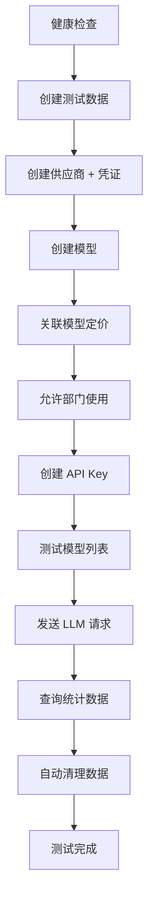

# E2E 测试指南

## 快速开始

### 1. 配置环境变量

```bash
cp .env.example .env.local
```

编辑 `.env.local`，填入必要配置：

```bash
# 必填：你的 Anthropic API Key
ANTHROPIC_API_KEY=sk-ant-xxxxx

# 可选：自定义上游地址（默认 https://api.anthropic.com）
ANTHROPIC_BASE_URL=https://api.anthropic.com

# 可选：测试用的模型 ID（默认 claude-3-5-haiku-20241022）
TEST_MODEL_ID=claude-3-5-haiku-20241022
```

### 2. 初始化数据库

```bash
# 创建表结构
npm run db:migrate:local

# 插入种子数据（可选）
npm run db:seed:local
```

### 3. 启动开发服务器

```bash
npm run dev
```

服务器将在 `http://localhost:8787` 启动。

### 4. 运行 E2E 测试

```bash
./tests/e2e/run.sh
```

测试会自动：
- 创建测试用的公司、部门、用户
- 配置供应商和凭证
- 创建模型并关联定价
- 创建 API Key
- 发送真实的 LLM 请求
- 查询使用统计
- **自动清理测试数据**

### 5. 手动清理（可选）

如果测试被中断或清理失败，可以手动重置数据库：

```bash
npx wrangler d1 execute ai-gateway-db --local --file=./scripts/reset-data.sql
```

## 关于 Admin API Key

**问题**: `.env.local` 中的 `ADMIN_API_KEY` 从哪里获取？

**答案**: 无需手动配置。E2E 测试脚本会自动创建测试用的 Admin Key，并在测试结束后自动清理。

如果需要手动创建（用于开发调试）：

```bash
# 方法 1: 使用初始化脚本
./scripts/init-dev-keys.sh

# 方法 2: 直接插入数据库（开发环境）
npx wrangler d1 execute ai-gateway-db --local --command "
  INSERT INTO api_keys (id, key_hash, key_prefix, user_id, company_id, department_id, name, quota_daily, quota_used, quota_bonus, is_unlimited, is_active, created_at, updated_at)
  VALUES ('ak_admin_manual', 'hash_sk_admin_test', 'sk_admin_', 'u_admin', 'co_demo_company', 'dept_engineering', 'Manual Admin Key', 0, 0, 0, TRUE, TRUE, $(date +%s)000, $(date +%s)000);
"
```

## 测试流程图



## 环境变量说明

| 变量 | 必填 | 默认值 | 说明 |
|------|------|--------|------|
| `ANTHROPIC_API_KEY` | ✅ | - | 上游 API 密钥 |
| `ANTHROPIC_BASE_URL` | ❌ | `https://api.anthropic.com` | 自定义供应商地址 |
| `TEST_MODEL_ID` | ❌ | `claude-3-5-sonnet-20241022` | 测试用模型 ID |
| `GATEWAY_BASE_URL` | ❌ | `http://localhost:8787` | 网关地址 |
| `ADMIN_API_KEY` | ❌ | 自动生成 | 管理 API 密钥 |

## 自定义供应商和模型

E2E 测试支持使用自定义的供应商和模型配置，方便测试不同的上游服务：

```bash
# 示例：使用自定义代理和模型
ANTHROPIC_BASE_URL=https://your-proxy.com/v1
ANTHROPIC_API_KEY=your-custom-key
TEST_MODEL_ID=custom-model-name
```

测试脚本会：
1. 根据 `ANTHROPIC_BASE_URL` 创建/查找供应商
2. 使用 `TEST_MODEL_ID` 创建/查找模型
3. 自动关联供应商凭证和模型定价
